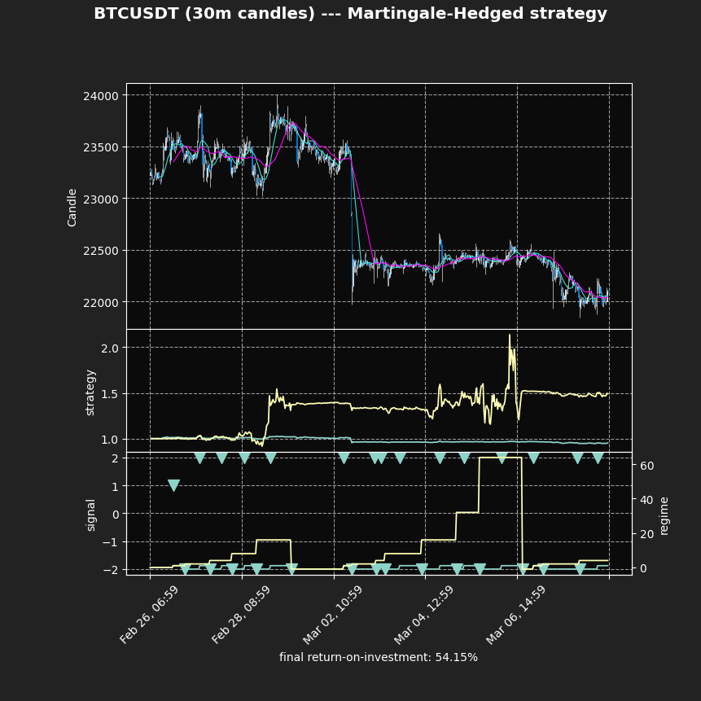

# bitcharts

This repository contains restructured material from the Google Colab notebook titled: [<b><i>Coupled Martingale Strategy Testing on Bitcoin Trading</i> (Garcia)</b> ](https://colab.research.google.com/drive/1SnWa53xzA83IYTlgqP8eOx5LB82ux8SG?usp=sharing) in a project format. Usage (terminal):

```ruby
git clone ...
cd bitcharts
python scripts.py
```

## Continuity

The contents from this project are rooted on the Martingale strategy which is showcased in the [<b><i>Martingale DCA on Coin Flip Games</i> (Garcia)</b>](https://colab.research.google.com/drive/1ZK_eW-kyHN3vMjPN_D0TAerG6J631ooV?usp=sharing) Google Colab Notebook.

#### Disclaimer : Not financial advice
<sub>
The information contained on this Colab notebook site, resources available for download and associated material thereof ("the Media") are not intended as, and shall not be understood or construed as, financial advice. Andrew Garcia ("the Author") is not an attorney, accountant nor financial advisor, nor is he holding himself out to be, and the information contained on this site is not a substitute for financial advice from a professional who is aware of the facts and circumstances of your individual situation. Though the Author has attempted to provide information that is accurate and valuable, nothing available on or through the Media should be understood as a recommendation that you should not consult with a financial professional to address your particular information. On that note, the Author expressly recommends that you seek advice from a professional. 
</sub>


<sub>
The Author is also not endorsing the Martingale strategy nor any strategy explained or showcased in the Media. The Author shall not be held liable or responsible for any errors or omissions on this site, nor for any damage you may suffer as a result of failing to seek competent financial advice from a professional who is familiar with your situation.
</sub>



