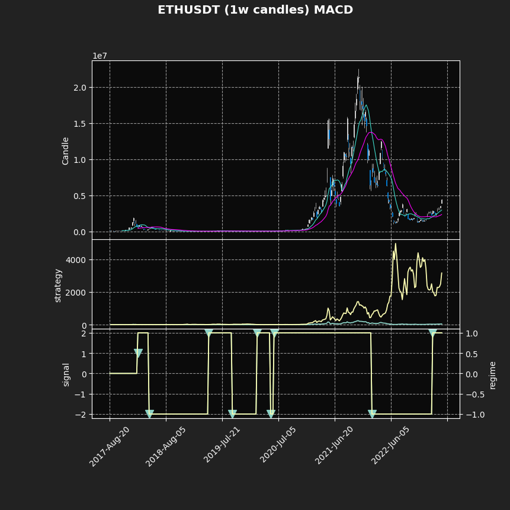

Usage
=====

DISCLAIMER: The information and code provided in this package is for educational and informational purposes only and is not intended to be used as financial advice. The authors of this package are not responsible for any financial decisions made based on the use of this package. Always do your own research and consult with a licensed financial advisor before making any investment decisions.

The following code script demonstrates how to use Cointables to backtest the MACD signal against the market for a specific cryptocurrency, and plot the resulting data using the mplfinance package. 

NOTE: You will need to install `mplfinance <https://pypi.org/project/mplfinance/>`_ independently for the below plotting capabilities. In addition, you will need to make a separate ``config.py`` file in the same directory where you define 2 variables, **API_KEY** and **API_SECRET**, your Binance API keys in string format. 

.. code:: python

    import cointables as coin 
    import mplfinance as mpf

    from binance.client import Client
    import config
    import tests.calcs as calcs

    # Create a new instance of the Chart class with the specified client, coin, market, and candle settings
    chart = coin.Chart(client=Client(config.API_KEY, config.API_SECRET))
    chart.coin = 'ETH'
    chart.market = 'USDT'
    chart.candles = '1w'

    # Retrieve price data from Binance using the Chart class
    chart.coinGET()
    print(chart.dataframe)

    # Perform MACD calculations and strategy computations
    df = calcs.rollstats_MACD(chart.dataframe)
    df = calcs.regimes(df)
    df = calcs.strat_compute(df)

    # Define addplots for the mplfinance plot
    ap = [
        mpf.make_addplot(df['market'], panel=1, type='line',
                         ylabel='strategy', secondary_y=False),
        mpf.make_addplot(df['strategy'], panel=1,
                         type='line', secondary_y=False),
        mpf.make_addplot(df['signal'], panel=2, type='scatter',
                         markersize=100, marker='v', ylabel='signal'),
        mpf.make_addplot(df['regime_old'], panel=2,
                         type='line', ylabel='regime'),
        mpf.make_addplot(df['regime'], panel=2, type='line', ylabel='regime'),
    ]

    # Define the style for the mplfinance plot
    s = mpf.make_mpf_style(base_mpf_style='nightclouds', figcolor='#222')

    # Plot the data using mplfinance
    mpf.plot(df, title=chart.coin + chart.market + " ({} candles) {}".format(chart.candles, title_extra),
             mav=(12, 26), type='candle', ylabel='Candle', addplot=ap, panel_ratios=(2, 1), xlabel=chart.message,
             figratio=(1, 1), figscale=1.5, style=s)

   The resulting plot shows the backtest of the MACD signal against the market for the specified cryptocurrency.

